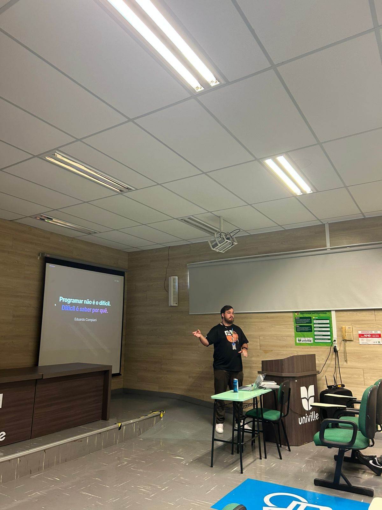
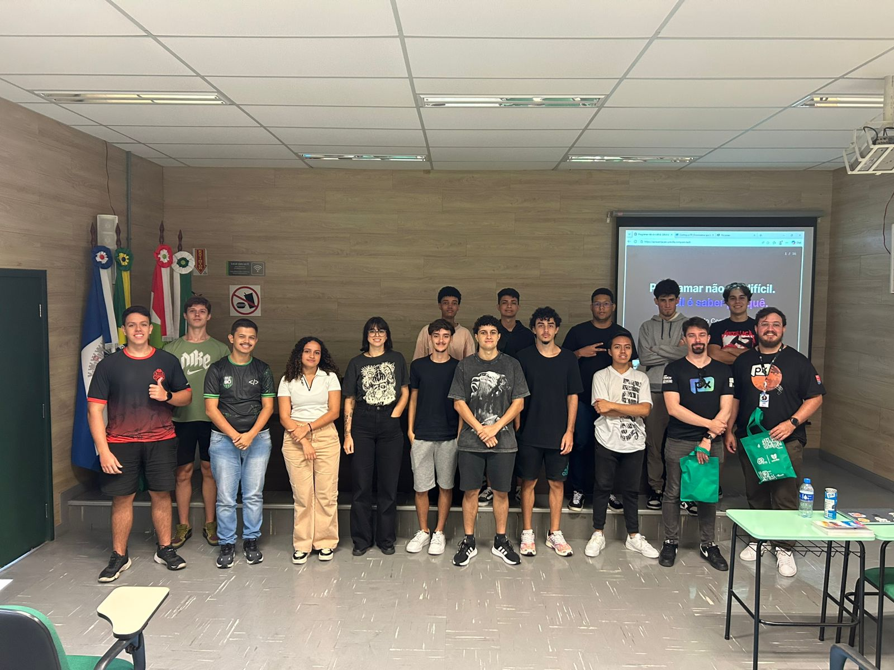

# Programar não é o difícil. Difícil é saber por quê.

Apresentação web criada para palestra ministrada por **Eduardo Compiani** no dia **24/03/2026** para a turma do 1º semestre de Engenharia de Software (matutino) da **UNIVILLE**.

## Sobre a palestra

A palestra teve como objetivo mostrar que a maior dificuldade na carreira de tecnologia não é aprender a programar, mas sim ter direção, entender o mercado e desenvolver a mentalidade certa.

### Temas abordados

- Trajetória pessoal: da curiosidade infantil à carreira em tecnologia
- O erro de querer aprender tudo ao mesmo tempo
- Mitos e realidades sobre entrar no mercado de trabalho
- O que faz um profissional se destacar (e o que atrasa)
- O futuro da área e o papel da IA
- Conselhos práticos para quem está começando
- Propósito na prática: a conexão entre carreira e impacto real (MotoristaPX)

## Fotos

| Apresentação | Público |
|:---:|:---:|
|  |  |

## Stack

- HTML, CSS, JavaScript (vanilla)
- Vite
- Deploy na Vercel

## Acesse

[apresentacao-univille.compiani.tech](https://apresentacao-univille.compiani.tech)
